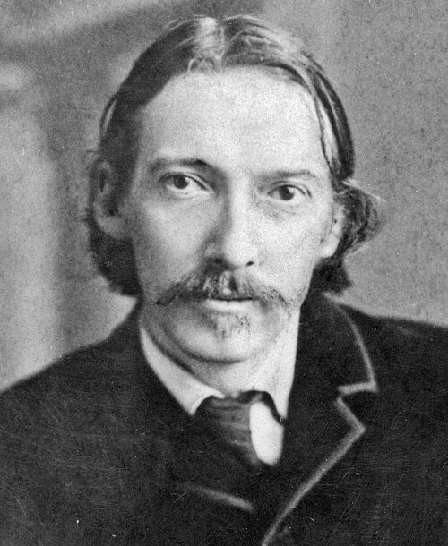

# This author
## Robert Louis Stevenson

Robert Louis Stevenson was a Scottish novelist. He was born on the 13th of November 1850 and died on the 3rd of December 1894. He is one of the most translated author in the world. Born in Edinburgh, he died in the Kingdom of Samoa where he became politcally engaged, advocating against the tyranny of great powers such as Great Britain, Germany and the United States. He was a renowned writer and was author of *Strange case of Dr Jekyll and Mr Hyde* but also *Treasure Island* which many also remember fondly from their childhood, or maybe they remember the more modern science-fiction adaptation from 2002 *Treasure Planet* better.
In any case, the influence of his work could scarcely be overstated as even the originals still draw considerable attention.  

[Homepage](index.md)
