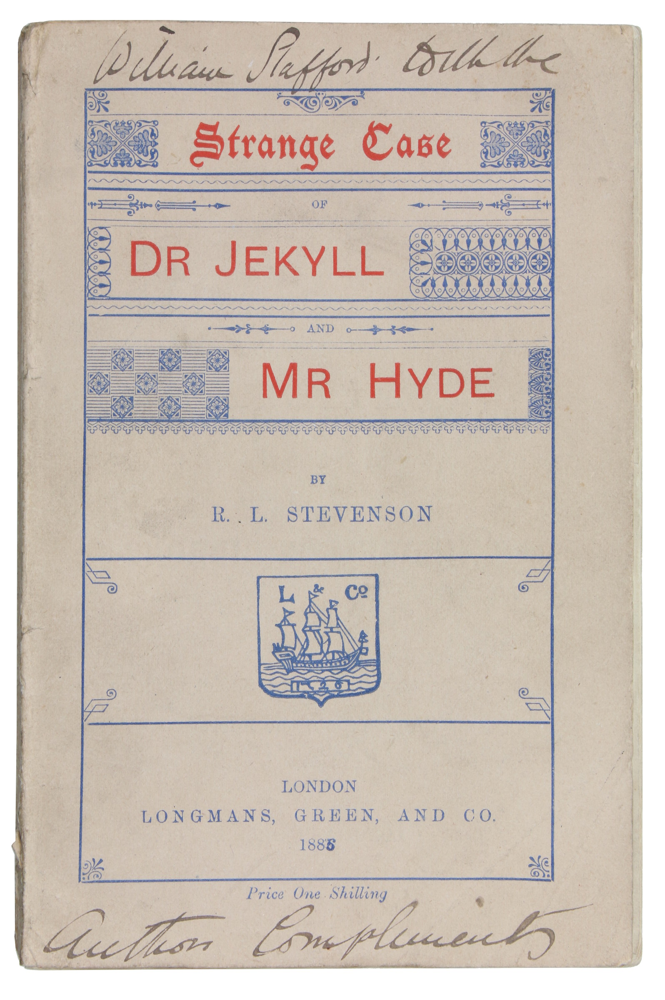

# Dr Jekyll and Mr Myde

### *Strange case of Dr Jekyll and Mr Hyde* is a horror novella written by Robert Louis Stevenson and published in 1886

While this book may be old, its influence can still be seen in today's pop culture. This website will explore some of its history, its author and its impact while trying to remain as spoiler-free as possible.

## What would you like to know about?
#### [Its author](author)

#### [Its history and the inspiration behind it](history)

#### [Its influence on pop culture](pop_culture)

# Keep in mind that the original book is now in the public domain in many countries and is available to read online for free! Click [here](https://www.gutenberg.org/files/43/43-h/43-h.htm) to read the original text.

[Source](https://en.wikipedia.org/wiki/Strange_Case_of_Dr_Jekyll_and_Mr_Hyde)
