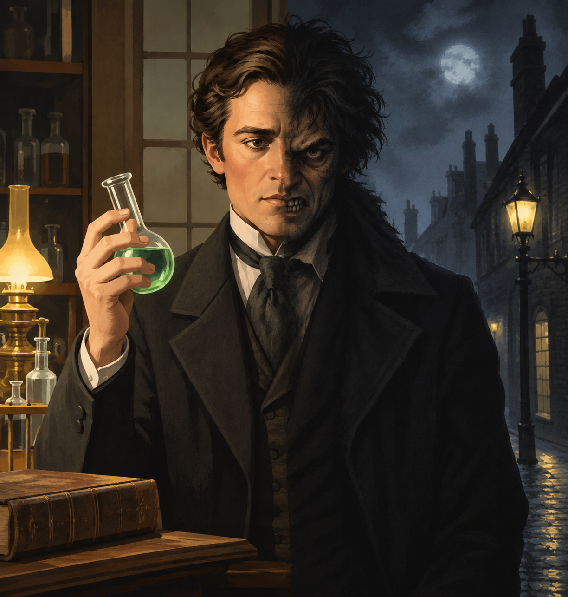

# Dr Jekyll and Mr Hyde in Pop culture

The impact this story has had over the years has been nothing short of tremendous. While many may not know the original book, it is virtually impossible to have never interacted with any of the works it influenced. The Hulk's conception, for example, likely took inspiration from both *Strange case of Dr Jekyll and Mr Hyde* and *Frankenstein's Monster*. Music lovers may know the Who's song called *Dr. Jekyll & Mr. Hyde*. Still in music but more likely to have been listened to recently by members of Gen Z, even if not intentionally, is Ezra Furman's song of the same name which was featured in the pilot episode of the series *Sex Education*.

[Homepage](index)
